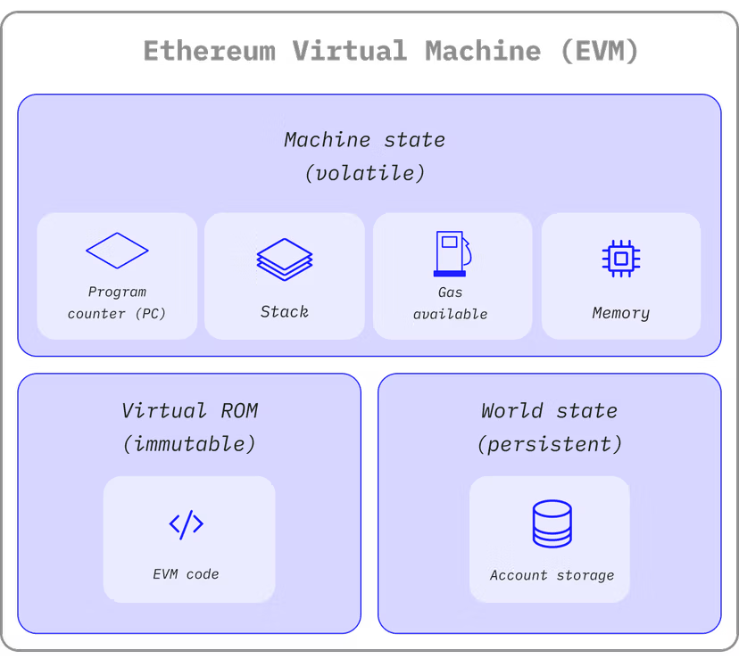
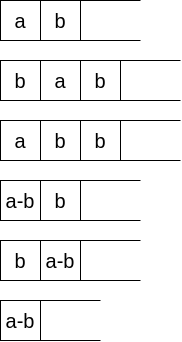

# EVM Bytecode Obfucator

## Background

Ethereum Virtual Machine (EVM) bytecode is at the core of smart contract execution on the Ethereum blockchain. When developers write smart contracts, they are usually compiled from high-level languages like Solidity into EVM bytecode, which is then deployed on the network. While this bytecode is efficient for execution, it is low-level and can be reverse-engineered to some extent, posing potential risks for intellectual property theft, unauthorized access, and exploitation of vulnerabilities.

### EVM and Opcode



The Ethereum VM is a stack-based, big-endian VM with a word size of 256-bits and is used to run the smart contracts on the Ethereum blockchain.


Contract execution starts at the beginning of the bytecode. Each opcode is encoded as one byte, except for the PUSH opcodes, which take a immediate value. All opcodes pop their operands from the top of the stack and push their result.

## Motivation

The motivation for developing an EVM bytecode obfuscator is to enhance the security and privacy of smart contracts on the Ethereum blockchain. As blockchain technology becomes more mainstream, the value of data and operations conducted through smart contracts increases, making them attractive targets for malicious actors. An obfuscator can serve several key purposes:

1. **Intellectual Property Protection**: By obfuscating the bytecode, it becomes significantly more complex to reverse-engineer, thereby protecting proprietary algorithms and logic embedded in smart contracts from competitors and hackers.

2. **Security Enhancement**: Obfuscation introduces additional layers of complexity to the bytecode, which can help to obscure vulnerabilities and hinder attacks, making it more challenging for attackers to analyze and exploit potential flaws.

3. **Privacy Preservation**: For contracts dealing with sensitive data, obfuscation can help in preventing unauthorized access and inference of data flows within the contract, thereby safeguarding user information and transactions.

4. **Compliance and Trust**: With increasing regulatory scrutiny on blockchain applications, providing enhanced data protection can help in achieving compliance and building trust with users and stakeholders who are concerned about privacy and security.

In summary, an EVM bytecode obfuscator addresses critical aspects of security, privacy, and intellectual property protection, making it an essential tool for developers and enterprises utilizing blockchain technology.

## Technical Route

### Design Overview

1. **Input Handling**:

   - **Compiling Solidity to ASM-JSON**:
     - Utilize the Solidity compiler (`solc`) to convert Solidity source code (`.sol` files) into its intermediate representation (IR), ASM-JSON.
     - This representation provides a structured format of the contract's operations, which simplifies the process of analysis and obfuscation without delving into raw bytecode or implementing a disassembler from scratch.

```sh
solc --asm-json --overwrite example.sol | tail -1 > example.asm.json
```

```json
{
  ".code": [
    { "begin": 58, "end": 731, "name": "PUSH", "source": 0, "value": "80" },
    { "begin": 58, "end": 731, "name": "PUSH", "source": 0, "value": "40" },
    { "begin": 58, "end": 731, "name": "MSTORE", "source": 0 },
    { "begin": 58, "end": 731, "name": "CALLVALUE", "source": 0 },
    { "begin": 58, "end": 731, "name": "DUP1", "source": 0 },
    { "begin": 58, "end": 731, "name": "ISZERO", "source": 0 },
    ...
  ],
  ".data": {
    "0": {
      ".auxdata": ".....",
      ".code": [
        { "begin": 58, "end": 731, "name": "PUSH", "source": 0, "value": "80" },
        { "begin": 58, "end": 731, "name": "PUSH", "source": 0, "value": "40" },
        { "begin": 58, "end": 731, "name": "MSTORE", "source": 0 },
        { "begin": 58, "end": 731, "name": "CALLVALUE", "source": 0 },
        ...
      ]
    }
  },
  "sourceList": ["example.sol", "#utility.yul"]
}
```

2. **Obfuscation Process**:

   - **Analyze and Transform ASM-JSON**:
     - Process the ASM-JSON to identify patterns or structures that can be obfuscated, such as specific opcodes or control flows.
     - Apply obfuscation techniques directly on the IR. This can include instruction insertion, substitution or reordering.

3. **Output Handling**:
   - **Compiling ASM-JSON to EVM Bytecode**:
     - Once the IR is obfuscated, use `solc` again to compile the modified ASM-JSON back into EVM bytecode.
     - This approach leverages `solc`'s ability to translate directly from ASM-JSON to binary, ensuring that the output remains compatible with the Ethereum Virtual Machine.

```sh
# compile to runtime bytecode
solc --import-asm-json --bin-runtime example_obfuscated.asm.json > example_obfuscated.bin.runtime

# compile to complete bytecode (with ctor)
solc --import-asm-json --bin example_obfuscated.asm.json > example_obfuscated.bin
```

### Instruction Insertion for Binary Operators

This technique involves inserting additional instructions around common binary operations (e.g. `ADD`, `SUB`, `MUL`, `DIV`, `EXP`, `GT`, `LT`...) to obscure the bytecode and make reverse engineering more challenging.

Let's take the `SUB` operation as an example:

- before obfuscation

```asm
SUB
```

- after obfuscation

```asm
DUP2    ; Duplicate the second to last stack item
SWAP1   ; Swap the top two stack items (ensure correct order of operands)
SUB     ; Perform SUB
SWAP1   ; Swap back the top two stack items
POP     ; Remove the redundant item from the stack
```

- stack



### Random Jump

The Random Jump technique is designed to obscure the control flow of EVM bytecode by introducing non-linear jumps between different sections of code. This approach hinders static and dynamic analysis, making it more difficult for an attacker to understand the program's execution path.

```asm
codePartA
codePartB
codePartC
JUMP [OUT]
```

```asm
codePartA

PUSH Tag 1      ; Prepare to jump to codePartB
JUMP            ; Jump to the location of Tag 1

Tag 2:
JUMPDEST        ; Destination for the jump from Tag 1
codePartC       ; Code executed after the jump
PUSH Tag 3      ; Prepare to jump to end
JUMP            ; Jump to end

Tag 1:
JUMPDEST        ; Destination for the jump from the main flow
codePartB       ; Code executed after codePartA
PUSH Tag 2      ; Prepare to jump to codePartC
JUMP            ; Jump to the location of Tag 2

Tag 3:
JUMPDEST
JUMP [OUT]
```

### Opaque Predicate

The Opaque Predicate technique introduces misleading conditional logic into the bytecode, complicating the control flow and obscuring the actual logic of the smart contract. By integrating seemingly relevant but ultimately irrelevant computations, this approach creates a diversion that hinders reverse engineering efforts.

#### Insert Opaque Predicate

In a simple conditional structure, the original logic and EVM bytecode might look like this:

```solidity
if (x > a) {
  // ...
}

if (f(x, y...) > a) {
  // ...
}

while (x > a) {
  // ...
}

require(x > a);

```

```asm
PUSH constantA
DUP1
GT
ISZERO (optional)
PUSH Tag 1
JUMPI

{code}

Tag 1:
JUMPDEST
```

After Adding Opaque Predicate

```asm
PUSH constantA
DUP1
GT
ISZERO (optional)
PUSH Tag 1
JUMPI

PUSH (b1 + b2) b1, b2 > constantA   ; may change according to the original oprand
DUP1
MUL
DUP1
DUP1
MUL
PUSH (b1 * b2)
ADD
LT                                  ; may change according to the original oprand
ISZERO                              ; may change according to the original oprand
PUSH Tag 2
JUMPI

{junk code}

Tag 2:
JUMPDEST

{code}

Tag 1:
JUMPDEST
```

```solidity
if (x > constantA) {
  if ((b1 + b2) * x < x * x + b1 * b2) {
    // junk code
  }
} else {
  // codePart B
}
```

This technique is highly adaptable; it can be modified to handle more complex comparisons beyond one variable and simple constants. For instance, conditions involving multiple function outputs can be camouflaged similarly by duplicating the result on the stack, further obfuscating the logic:

```solidity
if (f(x,y...) > constant) {

}
```

#### Junk Code Generation

To introduce more complexity to the code, we use a simplified AST to construct complex junk code. This strategy aims to introduce complexity and obfuscation into the bytecode by generating non-functional, yet syntactically correct junk code. Here's how each component works:

```txt
junk-stat: stat; value-consumer

stat:     if-else
        | loop
        | singleOp
        | binaryOp
        | tenaryOp
        | load

singleOp: PUSH v | DUPX | EVM global var (e.g. ADDRESS, CALLER)
binaryOp: stat; stat; BinaryOpcode (e.g. ADD, SUB...)
tenaryOp: stat; stat; stat; TenaryOpcode (e.g. ADDMOD, MULMOD...)
load:     stat; MLOAD/SLOAD/CALLDATALOAD

if-else:  stat;
          stat;
          comp Opcode(e.g. GT, LT...);
          ISZERO(optional);
          PUSH_TAG;
          JUMPI;
          stat; // if block
          TAG;
          JUMPDEST;
          stat; // else block

loop:     TAG1;
          JUMPDEST;
          stat;
          stat;
          comp Opcode(e.g. GT, LT...);
          ISZERO(optional);
          PUSH_TAG2;
          JUMPI;
          stat;
          SWAPX;
          POP;
          PUSH_TAG1;
          JUMP;
          TAG2;
          JUMPDEST;
          DUPX;

value-consumer:
          SWAPX; POP;
        | stat; MSTORE/SSTORE
```

## Evaluation

### Potency

rattle

### Stealth

### Resilience

### Cost

- Instruction Insertion for Binary Operators: 11 gas each

```asm
DUP2    ; 3 gas
SWAP1   ; 3 gas
SUB     ; --
SWAP1   ; 3 gas
POP     ; 2 gas
```

- Random Jump: 36 gas each

```asm
codePartA

PUSH Tag 1      ; 3 gas
JUMP            ; 8 gas

Tag 2:
JUMPDEST        ; 1 gas
codePartC       ; --
PUSH Tag 3      ; 3 gas
JUMP            ; 8 gas

Tag 1:
JUMPDEST        ; 1 gas
codePartB       ; --
PUSH Tag 2      ; 3 gas
JUMP            ; 8 gas

Tag 3:
JUMPDEST        ; 1 gas
JUMP [OUT]
```

- Opaque Predicate: ~ 48 gas each

```asm
PUSH constantA
DUP1
GT
ISZERO (optional)
PUSH Tag 1
JUMPI

PUSH (b1 + b2) b1, b2 > constantA   ; 3 gas
DUP1                                ; 3 gas
MUL                                 ; 5 gas
DUP1                                ; 3 gas
DUP1                                ; 3 gas
MUL                                 ; 5 gas
PUSH (b1 * b2)                      ; 3 gas
ADD                                 ; 3 gas
LT                                  ; 3 gas
ISZERO                              ; 3 gas
PUSH Tag 2                          ; 3 gas
JUMPI                               ; 10 gas

junk code

Tag 2:
JUMPDEST                            ; 1 gas
codePart A

Tag 1:
JUMPDEST

codePart B
```
